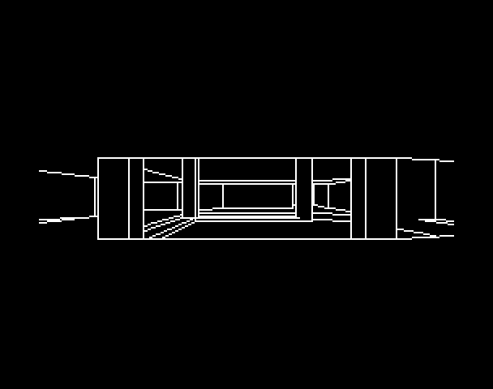

# DOOM on the 128K ZX Spectrum

A wireframe port of DOOM's E1M1 for a stock **ZX Spectrum 128K** — 3.5MHz Z80,
128K of paged RAM, 256×192 monochrome bitmap. Full BSP traversal, analytical
hidden-surface removal with trapezoid clip spans, perspective projection,
walkable with turning and strafing, double-buffered.



It is a companion to the [BBC Micro port](https://github.com/ebenupton/doom)
and shares that engine's arithmetic: the same 256×160 render window, the same
prescaled geometry, the same normalised-mantissa reciprocal and TRUE16 view
pipeline. Everything below the maths — the memory map, the rasteriser, the
span machinery, the traversal — is new and Z80-shaped.

## Running it

`build/doom.z80` is a 128K snapshot; load it in any Spectrum emulator (Fuse,
ZEsarUX, SpecEmu, jsspeccy). `build/doom.tap` is a tape image with a BASIC
loader and a bank-loading stub for real hardware — see *Status* below.

| Key | | Key | |
|---|---|---|---|
| **Q** / 7 | forward | **A** / 6 | back |
| **O** / 5 | turn left | **P** / 8 | turn right |
| **Z** | strafe left | **X** | strafe right |
| **SPACE** | run | | |

## Why the Spectrum makes this hard

DOOM assumes a 32-bit CPU, 16.16 fixed point and 64K of lookup tables. The Z80
has none of that, no multiply instruction, and a bitmap whose address layout
scatters consecutive scanlines 256 bytes apart. And on a 128K, the two screen
banks are both *contended* — the ULA steals cycles from every framebuffer
access during the display period.

Three decisions fall out of that:

**Two passes, so geometry and framebuffer never share the window.** Only 16K
of address space is pageable ($C000). Pass 1 pages in bank 0 — vertices, segs,
subsectors, sectors, nodes — and walks the BSP, emitting a *display list* of
already-clipped screen-space segments. Pass 2 pages in whichever bank holds the
back buffer and rasterises that list. Nothing needs both at once.

**All hot code and tables in bank 2.** Bank 2 is permanently at $8000 and is
uncontended, so the inner loops never pay ULA delays. The framebuffers are
contended either way; that is unavoidable.

**The two buffers differ only in address bit 15.** Buffer A is bank 5 at
$4000, buffer B is bank 7 at $C000 — same offsets, one bit apart. That is why
one set of row-address tables serves both, with a self-modified page byte
selecting which.

## The arithmetic

The only multiply primitive is an 8×8→16 **quarter-square** lookup:

```
a*b = f(a+b) − f(|a−b|),   f(n) = ⌊n²/4⌋
```

exact for all unsigned bytes because `a+b` and `a−b` share parity. Two
512-entry byte planes hold `f`, page-aligned so the 9-bit sum index costs one
`ADC` on the page byte. 148 T-states, built at boot in a single running add.

**The rotation goes through it.** A view transform is
`vx = wx·sin − wy·cos`, `vy = wx·cos + wy·sin`: four 16×8 products a vertex,
each of which is one quarter-square lookup because the world is prescaled
into nine bits, so the high partial is 0 or ±mag. A first version filled two
256-entry product tables per frame instead, which the BBC port had already
rejected: every viewpoint in the benchmark turns, so the 29k T-state build
was paid every frame against about 136 products, and the tables lost.

**Perspective projection collapses to 16 bits.** The reference computes
`sx = 128 + rns(X88·m9, S+8)` from a 25-bit product. Splitting
`X88·m9 = 256·W + (frac·M8 & 255)` with `W = vx·m9 + frac + (frac·M8 >> 8)`
makes `rns(X88·m9, S+8) ≡ rns(W, S)` — the discarded low byte is strictly less
than one unit, so it cannot change the floor. That removed the 32-bit
accumulator and a third of project_x's cost.

Rounding uses `rns(p,s) ≡ ((p >> (s−1)) + 1) >> 1`, exact for arithmetic
shifts, so no wide rounding constant is ever built.

## Hidden-surface removal

The visible region is a sorted array of inclusive column ranges, each carrying
a linear top and bottom boundary:

```
span = [xlo, xlast]   top(x) = ta·x + tb,  bot(x) = ba·x + bb
```

A frame holds a handful of spans rather than the per-column arrays DOOM uses:
three on average, ten at the worst viewpoint in the corpus.

Drawing and occlusion are the same pass. A boundary line that was drawn is,
by construction, inside the aperture on every column it lit — so on those
columns `max(old_top, line)` *is* the line, and the tighten is a copy rather
than a piecewise maximum with a crossover search. Columns where the line ran
past the far boundary close; columns where it never reached the near one keep
what they had. One walk of the span list therefore clips the seg's edges,
emits them, and narrows the aperture behind them, with the bottom line meeting
whatever the top line left. One-sided walls take the same walk and end it with
`mark_solid` instead.

Clipping is done in column space, not parametrically. A line is reduced once
to `y(x) = ((A·x) >> 8) + B`, and each span's two boundaries are evaluated at
the two ends of the overlap — once per span, shared by every edge of the seg.
Evaluating boundaries directly rather than as differences from the line keeps
the flat-boundary short circuit, which over a third of them take, and leaves
the exact aperture in hand so the endpoint clamp costs nothing extra. A divide
is reached only when the two ends disagree and a crossing has to be found.

Each span also records whether its aperture is open at both ends. The aperture
is linear, so that means open right across the span, and `has_gap` — the most
called query in the traversal — answers from the flag without evaluating
either boundary.

## Rasterisation

The display list is 4-byte records, y already in render space. Three plot
paths:

- **vertical** (`x1 == x2`) — wall edges are exactly vertical and dominate a
  DOOM wireframe, so this loop is unrolled across a character cell: `INC H`
  steps down a scanline and the cell-crossing fixup is paid once per eight
  pixels instead of once per pixel. The partial cells at each end enter the
  unrolled block through a self-modified `JP`.
- **horizontal** — whole bytes go out as `LD (HL),$FF`, under two T-states a
  pixel, with masked ends.
- **general** — Bresenham along the major axis.

Row addresses come from 160-entry byte planes, so a lookup is two loads. The
back buffer is blanked with `PUSH` (two bytes per 11 T-states, ~36k T-states
for the full bitmap), which beats erasing the previous frame's lines.

Measured over real frames: about 80 T-states a pixel drawn, 125k T-states a
frame including the clear.

## Traversal

Front-to-back, DOOM's own order: the near child is descended
unconditionally and only the far child pays a bounding-box test. Testing the
near box as well — which the BBC port does — prunes under 7% of subtrees here
while doubling the culling cost; dropping it took 19% off the frame.

Visibility is decided in angle space, as DOOM does it: the two silhouette
corners of the box go through `R_PointToAngle` (octant fold, one 16-by-8
divide, `ATANTAB`), the span is clipped to the ±45° field of view, and
`ANGTOX` maps the surviving angles to columns. Bounding boxes are stored
quantised to quarter-prescale bytes, so the reference quantises them
identically and the two agree by construction. Each
corner in front of the near plane is projected exactly once (the obvious
edge-walk projects every corner twice), and a straddling edge contributes its
near-plane crossing.

## Correctness

The engine is developed against a Python reference (`tools/ref.py`) that
mirrors it exactly — same primitives, same rounding, same tie-breaks. The
reference in turn is checked against the BBC port's bit-exact model
(`tools/oracle.py`), which is where the geometry pipeline comes from.

```
make test
```

- **math.test.js** — quarter-square table, `mul_u8` exhaustively over all
  65,536 operand pairs, signed variants, `rns`, `neg`.
- **raster.test.js** — 714 lines including every degenerate shape, compared
  pixel-for-pixel against a model of the plot loops.
- **view.test.js** — `sincos`, `view_setup`, `to_view`, `recip`, `project_x`
  and `project_y` against the Python reference: 4,984 assertions, all exact.
- **frame.test.js** — 1000 viewpoints scattered across the level. The Z80's
  entire display list is compared record-by-record with the reference's.

**All 1000 frames are byte-identical**: every clipped segment the Z80 emits
matches the reference in value and in order.

Getting there meant finding one bug class the hard way, over and over. The
Z80's `SBC HL,DE` sets carry for an *unsigned* borrow, and a dozen comparisons
in this engine are on signed 16-bit values — a span top that has gone negative
against a bottom that has not, a projected column tens of thousands of pixels
off-screen against the screen edge, a parametric `t` against zero. Every one
of them silently took the wrong branch, and each showed up as a different
visible symptom: no traversal at all, a hole in a wall, a missing edge in one
frame out of a thousand. They now route through `cmp_s16`, which corrects the
sign flag by the overflow flag. Coordinates that would overflow s16 are
saturated rather than allowed to wrap, for the same reason: a column at
+40000 that wraps lands back on screen.

## Speed

Honest numbers, measured on the emulator with ULA contention modelled, over
the tracked 109-frame walkthrough of E1M1:

| | T-states/frame | fps |
|---|---|---|
| best frame (facing a near wall) | 142k | 25.0 |
| median | 780k | 4.5 |
| mean | 806k | 4.4 |
| worst frame (the long start corridor) | 1.35M | 2.6 |

The tracked comparison is against the BBC port's own recorded baseline: the
same 18 viewpoints, its 6502 cycles beside these T-states, with parity meaning
T ≤ cycles × 1.773 (3.5469MHz against 2MHz). Both figures cover the same work
— traversal, clipping and line drawing, but not the screen clear, which sits
outside the BBC harness's counted region too.

| | 6502 cycles / Z80 T | fps |
|---|---|---|
| BBC Micro port | 2,956,217 | 12.2 |
| this port | 11,479,813 | 5.6 |

That is 2.19× off parity, from 3.72× when the engine first ran and 2.81×
before the register-file campaign below.

### What came over from the BBC port

Structure:

- **The fused draw-and-tighten walk.** A boundary line that was drawn is, by
  construction, inside the aperture on every column it lit, so there
  `max(old_top, line)` *is* the line: the tighten is a copy, not a piecewise
  maximum with a crossover search, and it happens in the pass that clipped the
  line. Both of a seg's boundary lines and all its other edges go through one
  walk of the span list.
- **Byte screen space.** Clipper y is a byte biased by 48, so the visible rows
  land at [48, 207] and anything a line reaches outside the band clamps to 0
  or 255 — the correct side of every boundary. Every y comparison is a `CP`.
- **Boundary extremes.** Each boundary carries its outer and inner value over
  the span, so 85% of clips need no boundary evaluation, no crossing search
  and no clamp: four byte comparisons and the line's own two ends.
- **A linked span pool** with a free chain, so a walk edits the spans it
  touches and leaves the rest alone.
- **Angle-space bounding boxes** — DOOM's own `R_CheckBBox`.
- **The seg chain**: four segs in five share `v1` with the previous seg's
  `v2`, so that seg's projected y pair carries over.

Arithmetic:

- **The log2/atanexp angle.** `ta(num, den) = ATANEXP[L(den) − L(num)]`, with
  `L(v) = L8[v]` under 256 and `L8[v>>3] + 96` above, the shifted-out half-bit
  averaging the two neighbours. `ATANEXP[k]` is the midpoint of the exact
  angle over the pairs in bucket k; exhaustively over `den` 2..2047 the error
  is 195 angle units, and every box is widened by it so a verdict is a
  superset of the exact one's. `point_to_angle` 1138 → 814 T-states.
- **Byte-at-a-time division** against an 8-bit remainder, leading zero bytes
  skipped: every slope here has a column span for a denominator.
- **Axis-aligned plotters**, and eight copies of the shallow-line step so the
  mask is an immediate in a `SET`: 74 → 37 T-states a pixel.
- **Single-caller inlining**, where the call and return were a measurable part
  of what the body cost.

Caches — all three ported, and what each is actually worth here:

| | hit rate | worth |
|---|---|---|
| translation-coherence vertex cache | 85% | **−11k T/frame** |
| `project_y` memo on `(h, M8, S)` | 34% | −2k T/frame |
| corner-angle memo | 12–20% | **+6k T/frame** |

The vertex cache is the big one: the view transform is exactly linear in the
integer world deltas, so `to_view(w) = L(w) + ref` for a fixed angle, and a
warm read is two adds. It earns nothing on a per-viewpoint benchmark, where
every angle differs, and a great deal in motion.

The corner memo does not pay on E1M1. `R_PointToAngle` is a pure function of
the delta pair so an entry never goes stale, but the geometric reuse is only
12–20% (a perfect unbounded memo measures 16% in the reference), and a
four-byte key probe costs a fifth of what the log2 angle now does. It is in,
page-aligned and as cheap as the probe can be made; `CPM_BASE` is the one
place to disable it.

Two of the BBC port's ideas are deliberately absent: its rotation-coherence
bbox cache, which that port has itself retired, and its 160-block unrolled
vertical plotter, which exists because the 6502 has no cheap "next scanline"
step — on the Z80 `INC H` already costs 22 T-states a pixel against the 30 an
unrolled absolute-addressed block would, and there is no room for 1.9K of
blocks.

### The register-file campaign

The first port was a transliteration: every value went through an absolute
address, as it would on a 6502, and the Z80's second register set and index
registers went unused. The second pass rewrote the hot routines from their
pseudocode as Z80: seg and node records are walked through `IX`, the two
endpoint cache records sit in `IX`/`IY`, `project_x`/`project_y`/`recip`
take and return their operands in registers, the span list is walked in
`IX` with pieces written once from their sources (no staging copy), the
record an op splits is kept as its own remainder rather than copied and
freed, the divide and the rounding shifts are unrolled, and the frame's
sin/cos products go through the quarter-square multiply rather than
per-frame product tables (the BBC port rejected those too; on turning
frames the 29k build cost more than it saved). The corner memo was measured
a net loss (about 10% hits) and is kept, as the BBC port keeps it.

`tools/flat.js` attributes every T-state to its enclosing label over the 18
parity viewpoints, and the BBC port's own `profile_subsystems.py` gives the
comparison. Per frame, in Z80 T-states against the BBC's cycles × 1.773:

| subsystem | this port | BBC port | ratio |
|---|---|---|---|
| vertex transform, projection, reciprocals | 137k | 69k | 2.0× |
| bbox visibility | 61k | 48k | 1.3× |
| span clipper (fuse, extras, verticals, lines, has_gap, mark_solid) | 200k | 60k | 3.3× |
| everything else (walk, seg glue, rasteriser) | 245k | 165k | 1.5× |

The clipper is the outlier, and the reason is architectural: the BBC port's
spans are two-point records — the y at each end of the span — so a drawn
line's ends are its values, a span's ends need no evaluation, and there is no
slope divide anywhere. This port's slope-intercept lines pay a 16-bit divide
per line and an 8×8 multiply per evaluation (`linfn` + `divs` 28k, `ev_at`
31k a frame). Everything else is within the ratio a byte-oriented 6502
program should hold over a Z80 doing the same in 16 bits.

## The toolchain

Everything here is scripted, because a Z80 engine you cannot test is a Z80
engine you cannot finish.

- `tools/spectrum.js` — a headless 128K Spectrum: 8 banks, the $7FFD paging
  port, ULA screen decode, keyboard matrix, an approximate contention model,
  and PNG output. Boots the real 128K ROM to its menu, which is how it was
  first checked. Built on Molly Howell's Z80 core (MIT).
- `tools/zcall.js` — calls individual Z80 routines from JavaScript with chosen
  registers and reads back results, which is what makes 65,536-case exhaustive
  tests of a multiply routine practical.
- `tools/mcp_spectrum.js` — an MCP server over the same machine: boot, run
  frames, press keys, screenshot (returns the PNG), peek/poke, registers,
  symbol lookup, and call-a-routine. Registered in `.mcp.json`.
- `tools/profile.js` — attributes frame time to routines by tracking the
  innermost active `CALL`.
- `tools/pack.py` — WAD → Spectrum banks, reusing the BBC port's dead-seg
  elimination, colinear merging and vertical-suppression analysis.

## Layout

| | |
|---|---|
| `src/spec.inc` | memory map: banks, tables, every variable |
| `src/math.z80` | quarter-square multiply, signed helpers, `rns`, `cmp_s16` |
| `src/view.z80` | trig, per-frame product tables, view transform, projection |
| `src/spans.z80` | division, trapezoid spans, the fused draw-and-tighten walk |
| `src/bsp.z80` | traversal, bbox culling, seg pipeline |
| `src/raster.z80` | display-list rasteriser, row tables, buffer clear |
| `src/main.z80` | boot, frame loop, paging, input, movement |
| `tools/ref.py` | the Python reference the Z80 is gated against |
| `tools/oracle.py` | driver for the BBC port's bit-exact model |

## Memory map

```
$0000-$3FFF  ROM (unused once running; the engine is IM2 with its own vector)
$4000-$5AFF  buffer A bitmap + attributes            bank 5, contended
$5B00-$67FF  display list (704 segments)
$6800-$6E18  node bounding boxes
$7000-$7FFF  vertex cache, 512 x 8
$8000-$83FF  quarter-square table                    bank 2, uncontended
$8400-$87FF  screen row address planes, both buffers
$8800-$8AFF  reciprocal mantissa/binade, sin quadrant
$8B00-$8EFF  per-frame i*sin and i*cos product tables
$8F00-$AF62  code
$B800-$BBBF  two span pools (40 spans each)
$BC00-$BFFF  variables and stack
$C000-$FFFF  bank 0: verts, segs, subsectors, sectors, nodes  (16032 bytes)
             bank 7: buffer B bitmap + attributes
```

## Status

Working: BSP traversal, span occlusion, clipping, rasterisation, double
buffering, turning, walking, strafing, run modifier, floor-height tracking,
109-frame walkthrough with no hangs.

Not done: animated sectors (doors and lifts — the BBC port's mover state
machines), collision, objects. The `build/doom.tap` loader is written and
assembles but is **untested against tape**, as this environment has no tape
emulation; `build/doom.z80` is the verified artefact.

---

Level data © id Software (shareware `DOOM1.WAD`, not included). Geometry
pipeline and fixed-point model from the BBC Micro port. Z80 core by Molly
Howell (MIT). Built with [sjasmplus](https://github.com/z00m128/sjasmplus).
